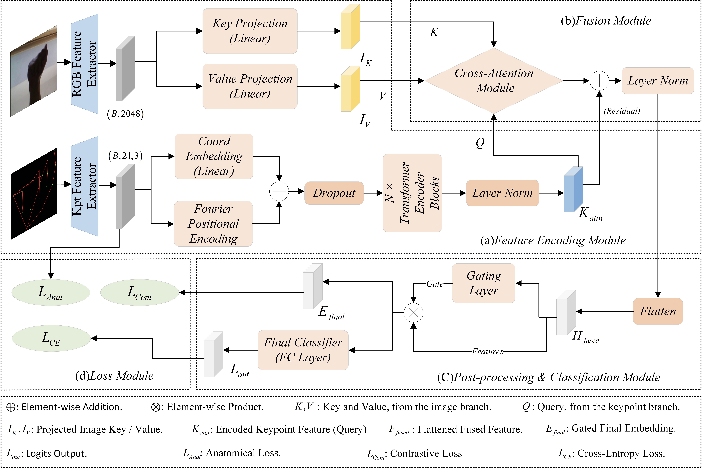

# AC-GCAT: 解剖约束图交叉注意力Transformer

这是论文 **"AC-GCAT: 基于解剖约束门控Transformer的鲁棒静态手势识别"** 的官方PyTorch实现。



## 🌟 亮点

- **SOTA性能**: 在ASL字母数据集上达到99.87%的准确率,具有卓越的鲁棒性(高斯1.0噪声下99.43%)
- **超高效**: 仅0.0864 GFLOPs(比ResNet-50低48倍),参数量2.31M
- **实时就绪**: 在RTX 4090上推理时间3.05ms,适合边缘部署
- **多模态融合**: 结合骨架关键点和视觉特征的新型门控交叉注意力机制
- **解剖约束**: 置信度感知的软约束,确保生物力学上合理的预测

## 环境要求


```bash
torch>=2.0.0
torchvision>=0.15.0
pandas>=1.5.0
numpy>=1.24.0
scikit-learn>=1.2.0
matplotlib>=3.6.0
seaborn>=0.12.0
joblib>=1.2.0
```

## 数据准备

### 支持的数据集

- **ASL字母数据集** (29类): [Kaggle链接](https://www.kaggle.com/dsv/29550) - 87,000张图像
- **NUS手势数据集** (10类): [官方网站](https://www.ece.nus.edu.sg/stfpage/elepv/NUS-HandSet/)
- **印度手语数据集** (36类): [Kaggle链接](https://www.kaggle.com/datasets/kartik2112/indian-sign-language-translation-letters-n-digits)
- **ASL数据集(小型)** (9类): [Kaggle链接](https://www.kaggle.com/datasets/grassknoted/asl-alphabet)

### 数据处理流程

#### 步骤1: 提取手部关键点 (MediaPipe)

```python
import cv2
import mediapipe as mp
import pandas as pd

mp_hands = mp.solutions.hands
hands = mp_hands.Hands(static_image_mode=True, max_num_hands=1, min_detection_confidence=0.5)

data = []
for img_path in image_paths:
    image = cv2.imread(img_path)
    results = hands.process(cv2.cvtColor(image, cv2.COLOR_BGR2RGB))
    
    if results.multi_hand_landmarks:
        landmarks = results.multi_hand_landmarks[0]
        row = {'image_path': img_path, 'label': label}
        
        for idx, lm in enumerate(landmarks.landmark):
            row[f'x_{idx}'] = lm.x
            row[f'y_{idx}'] = lm.y
            row[f'z_{idx}'] = lm.z
        
        data.append(row)

df = pd.DataFrame(data)
df.to_csv('all_landmarks_multimodal.csv', index=False)
```

#### 步骤2: 提取图像特征 (ResNet-50)

```python
import torch
import torchvision.models as models
import torchvision.transforms as transforms
from PIL import Image
import numpy as np

# 加载预训练的ResNet50
model = models.resnet50(pretrained=True)
model = torch.nn.Sequential(*list(model.children())[:-1])  # 移除分类器
model.eval()

# 图像预处理
transform = transforms.Compose([
    transforms.Resize(256),
    transforms.CenterCrop(224),
    transforms.ToTensor(),
    transforms.Normalize(mean=[0.485, 0.456, 0.406], 
                        std=[0.229, 0.224, 0.225])
])

# 提取特征
features = []
for img_path in df['image_path']:
    img = Image.open(img_path).convert('RGB')
    img_tensor = transform(img).unsqueeze(0)
    
    with torch.no_grad():
        feature = model(img_tensor).squeeze().numpy()
    features.append(feature)

# 保存特征
np.save('all_image_features_resnet50.npy', np.array(features))
```

### 使用预处理数据快速开始

预期的文件结构:
```
data/
├── ASL_Alphabet/
│   ├── all_landmarks_multimodal.csv
│   └── all_image_features_resnet50.npy
├── NUS_Hand_Posture/
│   ├── all_landmarks_multimodal.csv
│   └── all_image_features_resnet50.npy
├── Indian_Sign_Language/
│   ├── all_landmarks_multimodal.csv
│   └── all_image_features_resnet50.npy
└── asl_dataset/
    ├── all_landmarks_multimodal.csv
    └── all_image_features_resnet50.npy
```

## 安装

```bash
# 克隆仓库
git clone https://github.com/yourusername/AC-GCAT.git
cd AC-GCAT

# 创建虚拟环境
python -m venv venv
source venv/bin/activate  # Windows系统: venv\Scripts\activate

# 安装依赖
pip install torch torchvision torchaudio --index-url https://download.pytorch.org/whl/cu118
pip install pandas numpy scikit-learn matplotlib seaborn joblib
```

## 训练

### 训练完整SOTA模型(推荐)

```bash
python main.py \
    --study_name sota_only \
    --epochs 50 \
    --batch_size 128 \
    --learning_rate 3e-4 \
    --train_csv_path "data/ASL_Alphabet/all_landmarks_multimodal.csv" \
    --image_features_path "data/ASL_Alphabet/all_image_features_resnet50.npy" \
    --output_dir "./results_asl"
```

### 运行完整消融研究(15个实验)

```bash
python main.py \
    --study_name full_ablation \
    --epochs 50 \
    --train_csv_path "data/ASL_Alphabet/all_landmarks_multimodal.csv" \
    --image_features_path "data/ASL_Alphabet/all_image_features_resnet50.npy" \
    --output_dir "./results_ablation"
```

这将运行:
- **10个线性实验**: 渐进式组件添加(实验1-10)
- **5个新组合实验**: 替代配置(实验11-15)

### 超参数搜索

```bash
# 嵌入维度搜索 [128, 256, 384, 512]
python main.py --study_name hyperparam_embed_dim --epochs 50

# 层数搜索 [2, 4, 6, 8]
python main.py --study_name hyperparam_num_layers --epochs 50

# 注意力头数搜索 [4, 8, 16]
python main.py --study_name hyperparam_num_heads --epochs 50

# 对比损失温度搜索 [0.05, 0.07, 0.1, 0.2, 0.5]
python main.py --study_name hyperparam_cont_temp --epochs 50

# 解剖损失权重搜索 [0.0, 0.01, 0.02, 0.05, 0.1]
python main.py --study_name hyperparam_anat --epochs 50

# 对比损失权重搜索 [0.0, 0.05, 0.1, 0.15, 0.2]
python main.py --study_name hyperparam_contrastive --epochs 50
```

### 批量处理多个数据集

```bash
chmod +x run_all_datasets.sh
./run_all_datasets.sh
```

编辑 `run_all_datasets.sh` 以自定义数据集路径。

## 测试

### 测试预训练模型

```bash
python main.py \
    --mode test \
    --model_path "./results/weights/best_model_Exp_10_Full_SOTA_21kpts.pth" \
    --model_name "HybridAttentionModel" \
    --test_csv_path "data/test_set/test_landmarks.csv" \
    --image_features_path "data/test_set/test_image_features.npy" \
    --output_dir "./results"
```

## 模型架构

### 关键组件

1. **特征工程(C1)**: 增强3D关键点(x, y, z),包括:
   - 骨骼向量(3维)
   - 关节角度(1维)
   - 指尖距离(4维)
   - 总计: 每个关键点11维

2. **多模态融合(C2)**:
   - **自注意力**: 4层Transformer编码器处理骨架特征
   - **交叉注意力**: 骨架特征(Query) × 图像特征(Key/Value)
   - **自适应全局门控**: 融合后的动态特征优化

3. **双重约束损失(C3)**:
   - **交叉熵损失**: 使用标签平滑(0.1)
   - **解剖损失**: 置信度感知的软约束
     - 关节角度约束(放宽至[-π/2, 3π/2])
     - 骨骼长度比验证(放宽至[0.5-1.5×, 0.4-1.2×])
     - 手掌平面性正则化
     - 余弦退火调度(强到弱)
   - **监督对比损失(InfoNCE)**: 温度τ=0.1

### 架构配置

| 模型 | 输入维度 | 嵌入维度 | 层数 | 注意力头 | 参数量(M) | FLOPs(G) |
|------|----------|----------|------|----------|-----------|----------|
| MLPBaseline | 3D/11D | - | - | - | 2.1 | 0.0042 |
| AdvancedAttentionModel | 11D | 256 | 4 | 8 | 8.5 | 0.0312 |
| ImageOnlyBaseline | 2048D | - | - | - | 25.6 | 0.0026 |
| **HybridAttentionModel (SOTA)** | **11D+2048D** | **256** | **4** | **8** | **19.10** | **0.0864** |

## 实验结果

### ASL字母数据集性能(87k图像, 29类)

| 配置 | 测试准确率 | 高斯0.5 | 高斯1.0 | 遮挡3点 | 结构化噪声 |
|------|-----------|---------|---------|---------|-----------|
| 实验1 (MLP基础) | 97.97% | 82.07% | 53.84% | 88.15% | 89.60% |
| 实验3 (注意力高级) | 99.38% | 97.71% | 91.33% | 99.34% | 98.66% |
| 实验5 (后期融合) | 99.65% | 99.32% | 97.59% | 99.63% | 99.41% |
| 实验7 (门控交叉注意力) | 99.79% | 99.74% | 99.57% | 99.79% | 99.77% |
| **实验10 (完整SOTA)** | **99.87%** | **99.73%** | **99.43%** | **99.79%** | **99.80%** |

### 跨数据集泛化能力

| 数据集 | 规模 | 类别数 | 测试准确率 | 高斯1.0 |
|--------|------|--------|-----------|---------|
| NUS手势 | 422 | 10 | 100.00% | 97.65% |
| 印度手语 | 9,023 | 36 | 99.61% | 99.56% |
| ASL数据集(小型) | 1,819 | 9 | 92.86% | **92.03%** ⚠️ |
| ASL字母 | 87,000 | 29 | 99.87% | **99.49%** ✅ |

⚠️ **关键发现**: 鲁棒性高度依赖于大规模训练数据。

### 与SOTA方法对比

| 模型 | 架构 | 准确率 | 参数量(M) | FLOPs(G) | 推理时间(ms) |
|------|------|--------|-----------|----------|-------------|
| ResNet-50 | 50层残差网络 | 97.41% | 25.6 | 4.1 | 15-20 |
| Vision Transformer | 12层ViT-Base | 88.59% | 86.6 | 17.6 | 25-35 |
| 4层CNN | Conv-Pool-Conv-Pool-FC | 99.91% | <5 | <1 | 3-5 |
| **AC-GCAT(我们的)** | **门控交叉注意力** | **99.87%** | **19.10** | **0.0864** | **3.05** |

## 关键超参数

| 参数 | 默认值 | 说明 |
|------|--------|------|
| `--embed_dim` | 256 | 嵌入维度(必须能被num_heads整除) |
| `--num_layers` | 4 | Transformer块数量 |
| `--num_heads` | 8 | 注意力头数量 |
| `--dropout` | 0.2 | Dropout率 |
| `--batch_size` | 128 | 训练批次大小 |
| `--learning_rate` | 3e-4 | OneCycleLR最大学习率 |
| `--weight_decay` | 0.05 | AdamW权重衰减 |
| `--anatomical_weight_final` | 0.02 | 解剖损失最终权重 |
| `--contrastive_weight` | 0.1 | 对比损失权重 |
| `--contrastive_temperature` | 0.1 | InfoNCE损失温度 |
| `--early_stopping_patience` | 10 | 早停耐心值(0=禁用) |
| `--seed` | 42 | 随机种子,保证可复现性 |

## 输出文件

训练后,框架会生成:

1. **总结报告**: `summary_report_<study_name>_<timestamp>.txt`
   - 所有实验的准确率排名
   - 鲁棒性评分(高斯1.0)
   - 训练时间对比

2. **模型权重**: `weights/best_model_<exp_name>_21kpts.pth`

3. **训练曲线图**: `plots/history_<exp_name>.png`
   - 训练/验证损失曲线
   - 验证准确率曲线

4. **混淆矩阵**: `confusion_matrix/cm_<model_name>.png`

5. **预处理工具**: 
   - `scaler_21kpts.pkl`
   - `label_encoder_21kpts.pkl`

6. **鲁棒性测试结果**: 包含以下噪声测试:
   - 高斯噪声(σ=0.5, 1.0)
   - 随机遮挡(3个关键点)
   - 结构化手指噪声(σ=0.8)

## 项目结构

```
AC-GCAT/
├── README.md                    # 本文件
├── requirements.txt             # Python依赖
├── config.py                    # 配置和参数解析器
├── main.py                      # 主训练/测试协调器
├── model.py                     # 模型架构
│   ├── MLPBaseline
│   ├── AdvancedAttentionModel
│   ├── ImageOnlyBaseline
│   └── HybridAttentionModel    # SOTA多模态模型
├── losses.py                    # 自定义损失函数
│   ├── HierarchicalContrastiveLoss (InfoNCE)
│   └── AnatomicalLoss (置信度感知)
├── train.py                     # 训练和评估逻辑
├── utils.py                     # 数据加载和预处理
├── run_all_datasets.sh          # 多数据集批处理脚本
├── figures/                     # 论文图表
└── data/                        # 数据目录(不包含)
    ├── ASL_Alphabet/
    ├── NUS_Hand_Posture/
    ├── Indian_Sign_Language/
    └── asl_dataset/
```

## 引用

如果您在研究中使用此代码,请引用:

```bibtex
@article{qu2025acgcat,
  title={AC-GCAT: An Anatomically-Constrained Gated Transformer for Robust Static Hand Gesture Recognition},
  author={Qu, Xianping and Guo, Zhipeng and Su, Xiaobo and Zhou, Caixia},
  journal={Pattern Recognition},
  year={2025}
}
```

## 致谢

我们的代码框架受以下项目启发:
- [AimCLR](https://github.com/LinguoLi/AimCLR) 用于基于骨架的对比学习
- [CrosSCLR](https://github.com/LinguoLi/CrosSCLR) 用于跨模态表示学习
- MediaPipe 用于手部关键点检测

## 许可证

本项目采用MIT许可证 - 详见 [LICENSE](LICENSE) 文件。

## 联系方式

- **作者**: 曲献平, 郭志鹏
- **邮箱**: qxp@cqvie.edu.cn, guo.zp@outlook.com
- **单位**: 重庆工程职业技术学院

